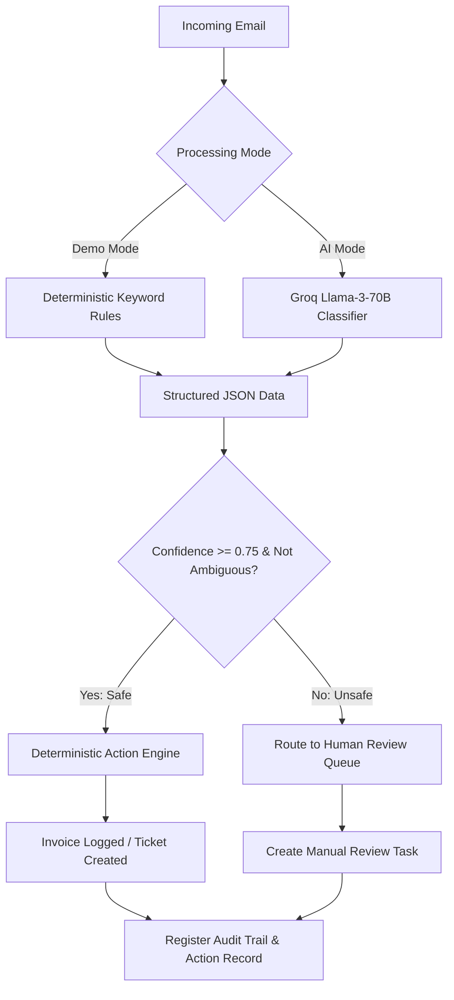

# Supervity Email-to-Action AI Employee

> **Turn incoming emails into intelligent, auditable business actions.**

*Disclaimer: This is a candidate-built technical assessment project inspired by the Supervity Forward Deployed Engineer (FDE) screening criteria. It is not an official Supervity product.*

---

## 1. Overview & Problem Statement
In enterprise operations, customer service inbox management consumes thousands of manual hours. Businesses receive hundreds of high-volume emails containing invoices, dispute requests, payment queries, and spam. 

Automating this with AI is highly desirable, but **blind AI automation is unsafe**. Large Language Models (LLMs) can hallucinate, misunderstand context, and cannot be trusted to execute business-critical database modifications or API actions directly.

## 2. Core Architectural Principle
This project implements the foundational design philosophy:
> **"AI interprets, deterministic business logic executes, humans handle uncertainty."**

The LLM is responsible *only* for reading unstructured email bodies and returning structured metadata (category, confidence, and key variables). The application's core action engine then uses deterministic validation, confidence safety gates, and rule-based priority routing to trigger actual operations. If confidence is low or ambiguity is detected, the workflow pauses, and the transaction is safely routed to a Human-in-the-loop (HITL) review queue.

---

## 3. System Architecture Workflow
The workflow sequence is illustrated below:



---

## 4. Features & Capabilities

- **Intelligent Classification**: Categorizes emails into:
  - `INVOICE_SUBMISSION`
  - `PAYMENT_QUERY`
  - `DISPUTE`
  - `SPAM`
- **Extracted Variables**: Automatically isolates invoice numbers, billing amounts, due dates, disputing reasons, and vendor names.
- **Demo Mode**: Fully operational out-of-the-box without requiring any API keys. Employs deterministic regex rules to simulate exact confidence metrics.
- **AI Mode**: Integrates with the server-side Groq Cloud API (`Llama-3.3-70B`) to parse unstructured files.
- **Confidence Safety Gate**: Routes any transaction below the $75\%$ confidence threshold directly to human reviewers.
- **Ambiguity Detection**: Specifically halts double-intent messages (e.g., asking for the status of an incorrect/disputed invoice).
- **Polished Enterprise UI**: Built with Next.js, featuring search bar lookups, filter toggles, action counters, detailed timeline audits, and settings sliders.
- **Traceable Logs**: Complete visibility over execution records.

---

## 5. Technical Stack
- **Frontend & Routing**: Next.js 16 (App Router), TypeScript, Tailwind CSS v4, Lucide Icons.
- **Server Logic**: Next.js API Routes (Server-Side State management in memory).
- **AI Engine**: Groq Cloud completions API (`llama-3.3-70b-versatile`) with structured JSON format modes.

---

## 6. Execution Modes & Safety Logic

### A. Demo Mode
- Runs locally. Does not call external APIs.
- Classifies emails based on keyword triggers.
- Provides identical, reproducible, and verifiable mock outcomes.

### B. AI Mode (Groq Integration)
- Active only when `GROQ_API_KEY` is present.
- Executes on the server side to protect secrets.
- Translates unstructured body text into valid JSON. Falls back gracefully to Demo Mode if Groq rates limits or errors out.

### C. Safety Thresholds & Actions
- **Safety Gate**: Threshold preset at $75\%$ (adjustable in Settings).
- **Invoice Submission**: Logs a mock invoice, marks action as "Invoice Logged", and drafts an confirmation.
- **Payment Query**: Creates a follow-up ticket and generates a status response.
- **Dispute**: Pauses payout, raises ticket priority to high, escalates to managers, and drafts an alert response.
- **Spam**: Suppresses auto-replies, logs reason, and flags internally.
- **Human Review**: Stops execution, populates manual review tasks, and documents reasoning.

---

## 7. Local Setup Instructions

### Prerequisites
- Node.js (v18.x or v20.x recommended)
- npm or yarn

### Installation Steps
1. Clone the project and navigate to the directory:
   ```bash
   cd supervity-fde
   ```
2. Install npm packages:
   ```bash
   npm install
   ```
3. Set up the Environment Variables (Optional for AI Mode):
   Create a `.env.local` file in the root directory:
   ```env
   GROQ_API_KEY="gsk"
   ```
4. Run the development server:
   ```bash
   npm run dev
   ```
5. Open your browser and navigate to:
   [http://localhost:3000](http://localhost:3000)

---

## 8. Deployment (Vercel)
This app is fully optimized for one-click deployment on **Vercel**:
1. Connect your GitHub repository to Vercel.
2. Configure environment variables in the project dashboard if using Groq (`GROQ_API_KEY`).
3. Deploy. The project compiles successfully under standard Next.js TS configurations.

---

## 9. Design Tradeoffs & Assumptions

### Technical Tradeoff: Hybrid Classification
We chose to combine **unstructured LLM understanding** with **rigid deterministic business logic**.
- *Why?* If the LLM were allowed to trigger database actions or direct payments via functions, a hallucination or prompt injection could lead to financial leakage. By constraining the LLM to outputting only structured classification metadata, we gain the flexibility of AI language processing while preserving strict rule-based control over execution.

### Assumptions
- In-memory mock storage is sufficient for demonstration. No active SQL database is integrated, keeping deployment clean and simple.
- The Groq API key provided during the assessment is configured on the server-side Next.js environment.

---

## 10. 5-Minute Interview Demo Script

1. **0:00–0:30 (Introduction)**: Open the dashboard tab. Explain that the dashboard derives KPIs directly from the active mock database state. Point out the system indicator displaying "Demo Mode" or "AI Mode".
2. **0:30–1:15 (Invoice Submission)**: Select `EMAIL-001`. Click "Process Email". Show how details (Acme / Vertex, amount ₹78,500, due date) are parsed, confidence evaluates to $94\%$, and an autonomous invoice logging action is successfully triggered. Show the generated draft response.
3. **1:15–2:00 (Payment Query)**: Select `EMAIL-004`. Process it. View how it creates a "Payment Follow-up Ticket" and informs the sender that payout is scheduled.
4. **2:00–2:40 (Dispute Escalation)**: Select `EMAIL-007`. Process it. Explain that the action engine halts remittance, escalates a priority ticket to the manager, and logs the specific reason ("Wrong hourly rate applied").
5. **2:40–3:30 (Ambiguous routing)**: Select `EMAIL-012` (the ambiguous case: Payment status query + Dispute). Process it. Point out that confidence drops to $58\%$. The safety gate ($75\%$) stops the workflow, marking the action as "Human Review Created". Explain that the safety gate prevents executing conflicting business workflows.
6. **3:30–4:15 (Traceability)**: Open the **Audit Log** and **Actions** tabs. Show how every processing transaction is fully logged with unique identifiers, timestamps, and confidence outputs.
7. **4:15–5:00 (Closing Summary)**: Re-emphasize the core architectural philosophy: **AI interprets, deterministic logic executes, humans handle uncertainty.**

---

## 11. Interview Q&A Cheatsheet

### Q1: Why did you choose Problem 10?
*Answer*: Problem 10 represents the most common challenge in enterprise AI operations: dealing with unstructured incoming communications. It requires balancing the flexibility of LLM comprehension with strict corporate compliance, security, and safety constraints.

### Q2: What is the benefit of having a Demo Mode?
*Answer*: It guarantees that the application is fully functional, testable, and demonstrable immediately in air-gapped environments or where API endpoints are rate-limited, cost-capped, or credentials are omitted.

### Q3: Why is the LLM prohibited from directly calling APIs?
*Answer*: LLMs are non-deterministic. A slight deviation in prompt context or model update could result in erroneous parameter values, calling delete functions, or releasing wrong payment amounts. Deterministic code validation prevents this.
